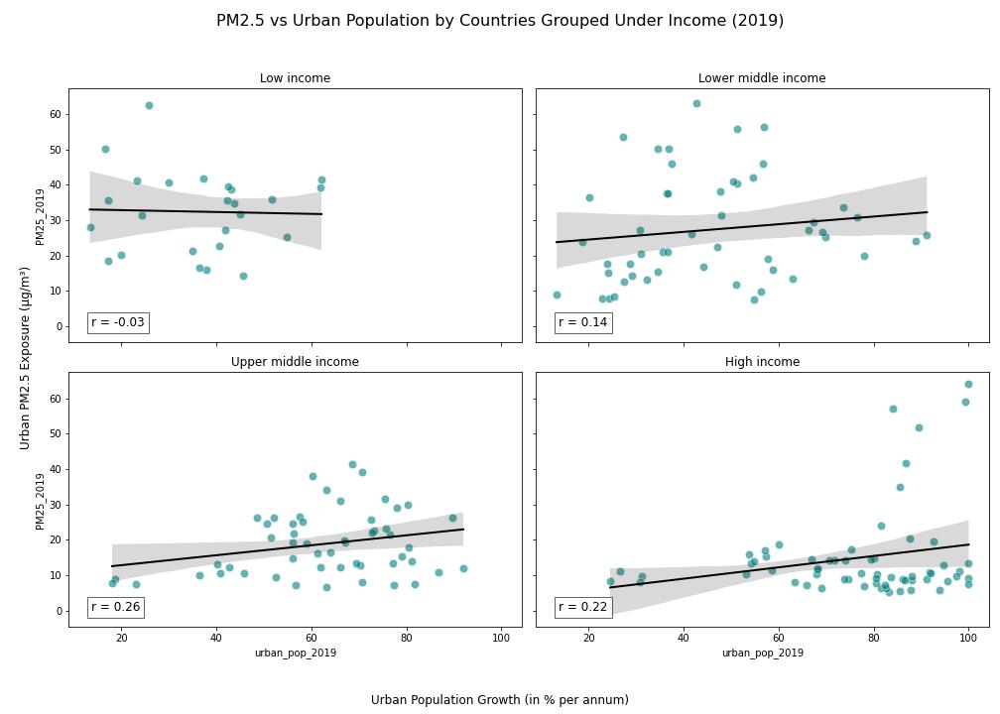

# Air Pollution and Urban Growth: A Global Income-Based Analysis (2019)

This project explores how urban population growth correlates with air pollution levels (PM2.5) across countries grouped by income level. The analysis aims to highlight whether economic development influences how urbanization impacts environmental health — particularly exposure to fine particulate air pollution.

---

## 📌 Research Question

**Does urban population growth correlate with PM2.5 air pollution exposure, and how does this relationship differ across country income groups?**

---

## 🌎 Region and Domain

- **Region:** Global (includes all income groups: low, lower-middle, upper-middle, and high)
- **Domain:** Environmental health & urban development

---

## 📊 Datasets Used

| Dataset | Description | Source |
|--------|-------------|--------|
| PM2.5 Exposure | Population-weighted annual concentration of fine particulate matter (urban areas only) | [Our World in Data](https://ourworldindata.org/grapher/pm25-air-pollution?time=2019) |
| Urban Population Growth (%) | Annual growth rate of urban population by country | [World Bank](https://data.worldbank.org/indicator/SP.URB.TOTL.IN.ZS) |
| Country Income Groups | Country classification into income groups (low to high) | [World Bank DataBank](https://databank.worldbank.org/reports.aspx?source=2&series=SP.URB.TOTL.IN.ZS&country=) |

---

## 📈 Visualization

The final chart contains **four scatter plots** — one for each income group — comparing PM2.5 exposure to urban population growth for the year **2019**:

- Each subplot includes a **regression line** and **Pearson correlation coefficient**
- Top 3 polluting countries in each group are **labeled**
- Shared axis scaling ensures fair comparison
- Annotated bottom-left corner displays correlation strength (`r` value)

---

## 💡 Key Insights

- **Weak to moderate correlations** exist between urban growth and PM2.5 levels, with differences by income level.
- **Higher-income countries** show slightly positive correlations, potentially reflecting better-managed infrastructure amidst urbanization.
- **Lower-income countries** show weak or negative correlations — possibly due to variability in pollution sources and limited monitoring data.
- Grouping by income adds interpretive value and supports policy-targeted environmental insights.

---

## 📁 Repository Contents

| File | Description |
|------|-------------|
| `analysis.ipynb` | Jupyter Notebook with full code |
| `urban_pop_vs_air_pollution1.jpg` | Final multi-plot visualization |
| `report.md` | 1–2 paragraph explanation aligned with assignment rubric |
| `README.md` | This project overview |

---

## 🧑‍💻 Author

Piya Mohasin

---

## 📜 License

This project is shared for academic and educational use under the MIT License.

